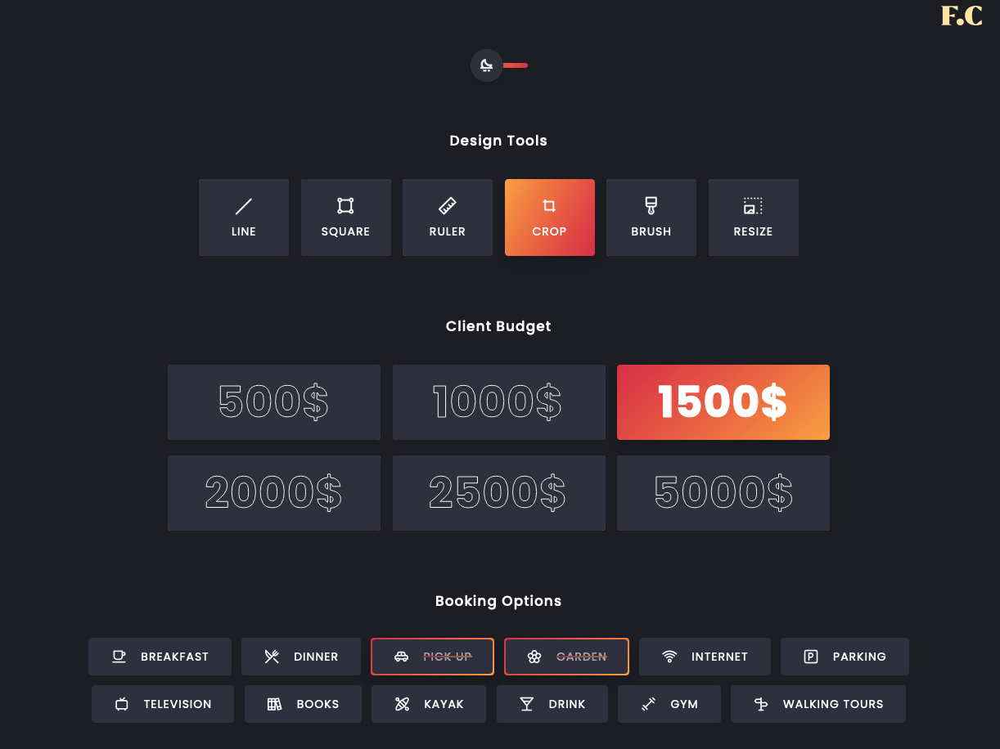

# Formulare sind sehr facettenreich

  - [Bitte eines oder mehrere dieser Formulare nachbilden](#bitte-eines-oder-mehrere-dieser-formulare-nachbilden)
  - [Individuelle Checkboxen und Radio-Buttons](#individuelle-checkboxen-und-radio-buttons)

## Bitte eines oder mehrere dieser Formulare nachbilden

Baue ein Formular, bspw. mit Namen- und Adressfeldern. Du kannst es dann später mit CSS gestalten und die Grenzen der Möglichkeiten erfahren. [Auf dem beispielhaften Screenshot](unterschiedliche-formulare.md) findest Du viele Anregungen für interessante Formulare.

Zum Layout sind Flexbox, CSS-Grids und Floats gleichermassen "erlaubt" und geeignet.

Experimentiere gerne mit unterschiedlichen Selektoren. Sinnvoll sind hier sowohl Attributselektoren, als auch formularspezische Selektoren.

Alles Wissenswertes rundum Formulare findest Du hier:

* https://developer.mozilla.org/de/docs/Learn/Forms
* https://wiki.selfhtml.org/wiki/HTML/Tutorials/Formulare 
* https://web.dev/learn/forms/

Weitere Anregungen geben hoffentlich folgende Artikel:

* https://www.mediaevent.de/css/form-input.html
* https://dev.to/oahehc/css-selectors-related-to-form-control-22pc
* https://blog.logrocket.com/how-to-style-forms-with-css-a-beginners-guide/ 


## Individuelle Checkboxen und Radio-Buttons

Formulare zu gestalten ist sehr schwer. Manche Designidee kann man nicht direkt erledigen. Man muss stattdessen Umwege gehen und sich einen Trick ausdenken.

Checkboxen und Radiobuttons kann man direkt nicht gut gestalten. Versuche es einmal:

````html

<div>
    <input type="checkbox" id="my-checkbox-1" name="check1">
    <label for="my-checkbox-1">Meine Checkbox 1</label>
</div>
<div>
    <input type="checkbox" id="my-checkbox-2" name="check2">
    <label for="my-checkbox-2">Meine Checkbox 2</label>
</div>
<div>
    <input type="radio" id="my-radio-1" name="radio1">
    <label for="my-radio-1">Mein Radiobutton 2</label>
</div>
<div>
    <input type="radio" id="my-radio-2" name="radio1">
    <label for="my-radio-2">Mein Radiobutton 2</label>
</div>
````

Als CSS bietet sich bpw. an:

````css
input[type="checkbox"] {
    background-color: red;
    width: 20px;
    height: 20px;
}
input[type="radio"] {
    background-color: blue;
    border: 2px solid red;
    width: 30px;
    height: 30px;
}
````
Probier das einfach mal aus und spiele mit unterschiedlichem CSS, gerne auch mit anderen Formularelementen.

Wenn man aber nicht das Formularelement, sondern **das assoziierte Label** gestaltet (und das Formularelement versteckt...), dann kann man [ziemlich tolle Designs](https://codepen.io/jensgro/full/yLMQdNQ) machen.



Das Verstecken eines Formularelementes geht vorzugsweise so:

````css
[type="checkbox"],
[type="radio"]{
  border: 0;
  clip-path: inset(50%);
  display: inline-block;
  height: 1px;
  margin: -1px;
  overflow: hidden;
  padding: 0;
  width: 1px;
  white-space: nowrap;
}
````

Der Vorteil dieser Methode ist, dass das Formularelement für Screenreader noch voll zugänglich ist, Sehende es aber nicht wahrnehmen. Ein ``display: none`` hätte das Formularelement auch vor Screenreadern versteckt und das Element wäre nicht anwählbar. Unsere Seite wäre nicht zugänglich, für Screenreadernutzer nicht nutzbar.
