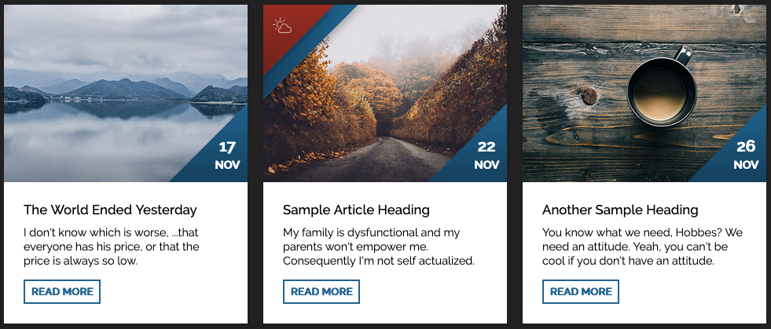

# Card mit Hovereffekt erstellen

Erstelle drei oder mehr Cards anhand dieses Layouts:

Die dreieckigen Container mit den Daten sind immer sichtbar. Die Container in der linken, oberen Ecke erscheinen bei `:hover`.
