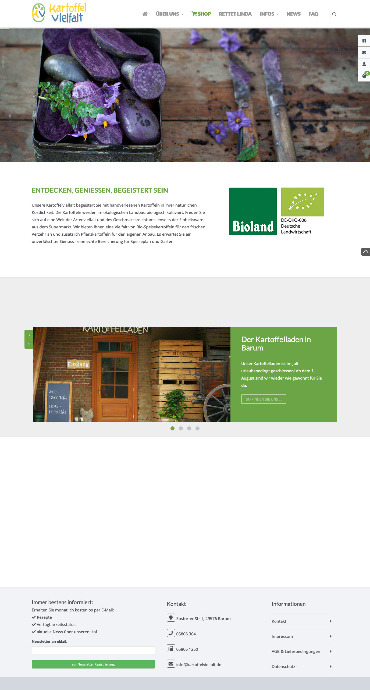
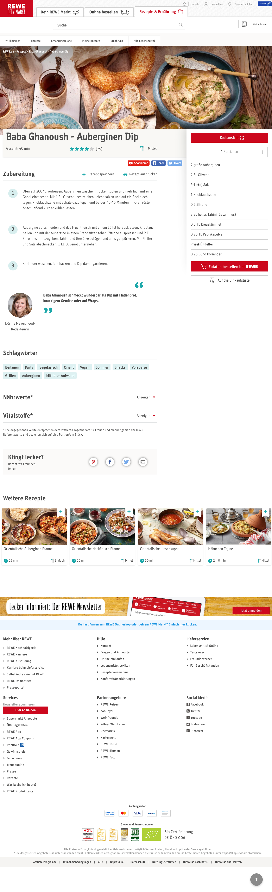
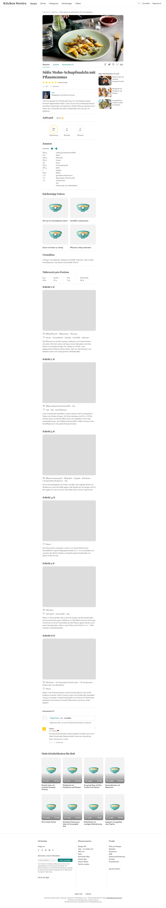
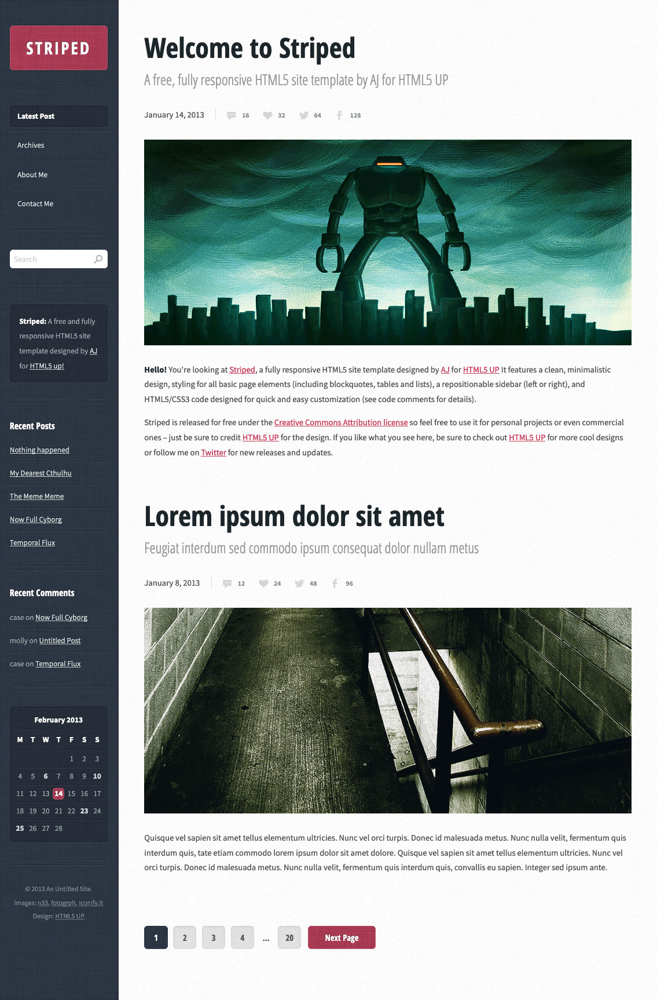
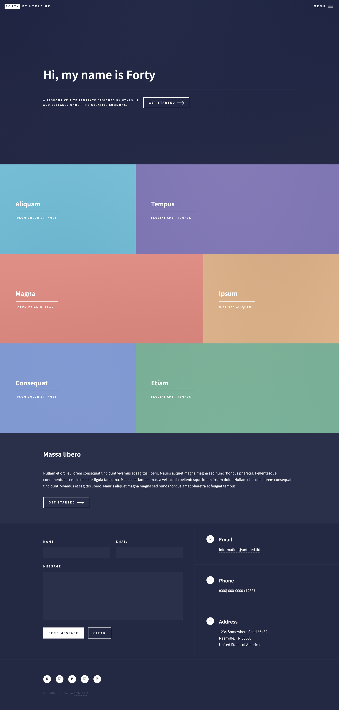
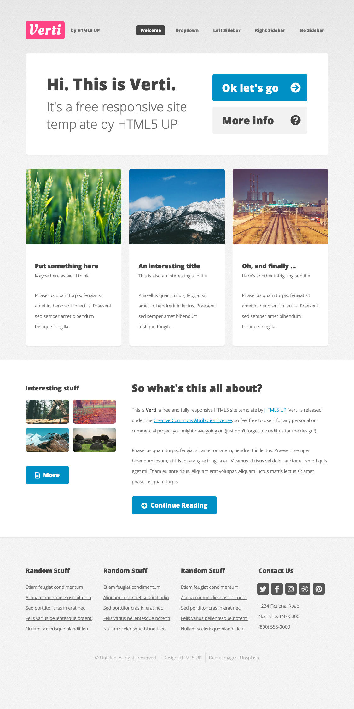

# Seitenvorlagen als Anregung für eigene Entwicklung

Die hier aufgeführten Seitenvorlagen sollen Ihnen als Anregung für eigene Entwicklungen zu dienen. Sie können gerne die jeweils pro Design vorliegenden Originaltexte und -bilder benutzen. Die exakten Inhalte dieser Vorlagen sind allerdings gleichgültig. Benutzen Sie am Besten entweder eigene Inhalte (Texte und Bilder) oder [Blindtexte](http://www.blindtextgenerator.de/) und [Platzhalterbilder](https://codepen.io/jensgro/full/HFnsE). 

## Das sind die Designideen

### Kartoffelvielfalt 

### Rewe-Rezept

### Schupfnudel-Rezept

### Wordpress-Theme "Striped"

### Wordpress-Theme "up-forty"

### Wordpress-Theme "verti"

