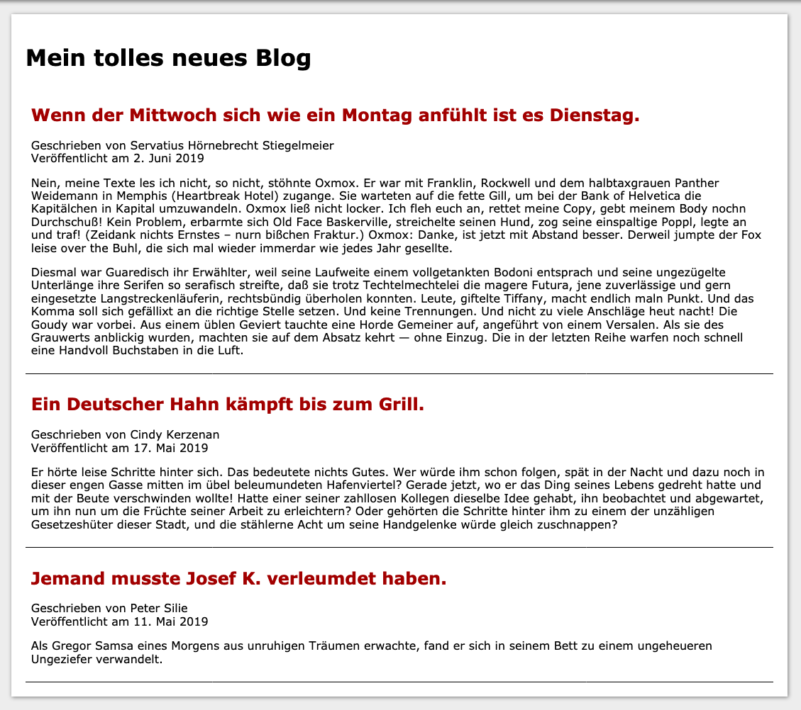

# Erstelle eine HTML-Grundstruktur

Erstelle eine HTML-Seite. Nimm den Text aus blog.txt und erstelle innerhalb dieser HTML-Seite ein Blog. Die Texte sollten klar machen, welcher Art Text es ist. Der untenstehende Screenshot sollte deutlich machen, wie die Struktur am Ende sein wird.

Es geht hierbei **nur** um das HTMl, also um die Struktur. Es muss **nichts** gestaltet werden. Es reichen vollkommen die Styles, die der jeweilige Browser mitbringt.

